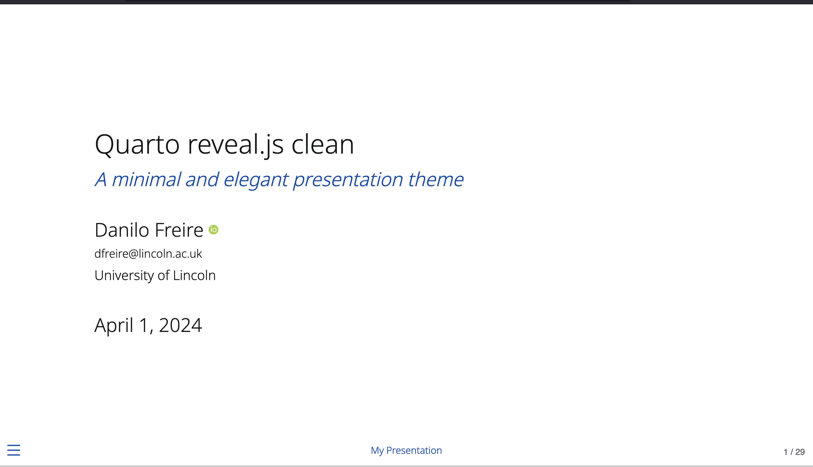

# Quarto Presentation

This repository hosts a forked version of the [Quarto clean presentation theme](https://github.com/grantmcdermott/quarto-revealjs-clean). The original theme was designed by [Grant McDermott](https://grantmcdermott.com/) and I thank him for his excellent work. Although I have introduced a few minor modifications for personal use, the essence and aesthetic of the presentation remain very close to the original design. You can view the modified version of the presentation [here](https://danilofreire.github.io/quarto-presentation/quarto-presentation.html).

[](https://danilofreire.github.io/quarto-presentation/quarto-presentation.html)

## Modifications

The (small) modifications made to the original Quarto Clean theme are:

- Adjustments to the color scheme.
- Font changes for improved readability.
- Additional slide transition options.
- Quarto plugins that are not part of the original theme but are useful for my presentations.

## How to Use

To use this forked version in your Quarto presentations, follow these steps:

1. Clone this repository to your local machine.
2. Copy the modified theme files into your Quarto project directory.

You can also add this theme to your directory with:

```bash
quarto install extension danilofreire/quarto-presentation
```

For a detailed guide on using custom themes in Quarto, please refer to the [Quarto Documentation](https://quarto.org/docs/presentations).

## Credits

All credits for the original design and development of the Quarto Clean theme go to [Grant McDermott](https://grantmcdermott.com/). I would also like to thank [Martijn de Jongh](https://martinomagnifico.github.io/) for [Appearance](https://github.com/martinomagnifico/quarto-appearance) and [Multimodal](https://github.com/Martinomagnifico/quarto-multimodal), the [R for WebAssembly team](https://github.com/r-wasm) for [Quarto Drop](https://github.com/r-wasm/quarto-drop), and the [Quarto team](https://quarto.org/) for creating such a great tool.

You can add more extensions to your Quarto project with:

```bash
quarto install extension repositoryowner/repo
```

A list of available extensions can be found at <https://m.canouil.dev/quarto-extensions/>.

## License

This version of the Quarto Clean theme is available under the same license as the original. Please see the LICENSE file for more details.
