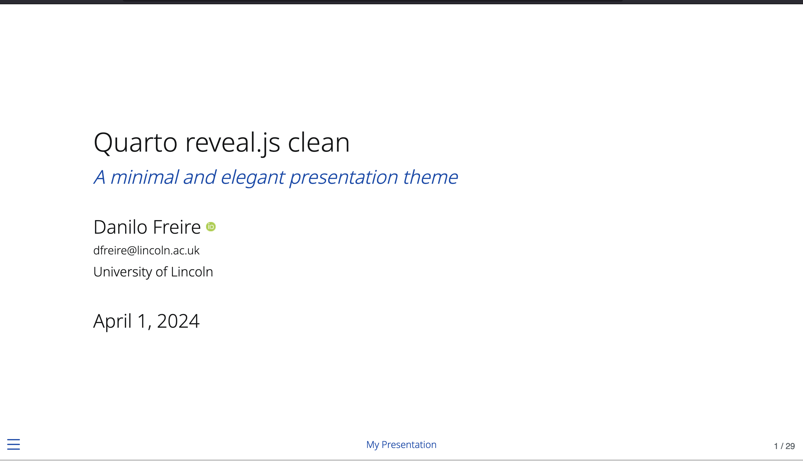

::: {.column-screen}
```{=html}
<div class="hero">
  <div class="hero-inner">
    <div class="hero-title">Quarto reveal.js clean</div>
    <p class="lead">A minimal and elegant reveal.js presentation theme for Quarto. This is a personal fork of Grant McDermott's clean theme, with a few small tweaks to colours, fonts, and extensions.</p>
    <div class="badges">
      <span class="badge-pill">reveal.js</span>
      <span class="badge-pill">minimal</span>
      <span class="badge-pill">MIT licence</span>
      <span class="badge-pill">fork of clean</span>
    </div>
    <div class="hero-actions">
      <a class="btn-hero primary" href="quarto-presentation.html">Open the live demo</a>
      <a class="btn-hero ghost" href="https://github.com/danilofreire/quarto-presentation">View on GitHub</a>
    </div>
  </div>
</div>
```
:::

```{=html}
<div class="demo-wrap">
  <a class="demo-frame" href="quarto-presentation.html" aria-label="Open the interactive slides">
    <div class="demo-bar">
      <span class="dot"></span><span class="dot"></span><span class="dot"></span>
      <span class="label">quarto-presentation.html</span>
    </div>
    
  </a>
  <p class="demo-caption"><a href="quarto-presentation.html">Open the interactive slides &rarr;</a> &nbsp;·&nbsp; use the arrow keys to move through them</p>
</div>
```

::: {.section-head}
## What this fork changes
:::

```{=html}
<div class="feature-grid">
  <div class="feature">
    <div class="ico">&#9632;</div>
    <div>
      <h3>Adjusted colour scheme</h3>
      <p>A deep blue accent and a near-black body colour, tuned for projector and screen contrast.</p>
    </div>
  </div>
  <div class="feature">
    <div class="ico">Aa</div>
    <div>
      <h3>Different fonts</h3>
      <p>Font choices changed for clearer reading at a distance, while keeping the theme's calm feel.</p>
    </div>
  </div>
  <div class="feature">
    <div class="ico">&#8644;</div>
    <div>
      <h3>More transitions</h3>
      <p>Extra slide transition options, so you can match the motion to the talk.</p>
    </div>
  </div>
  <div class="feature">
    <div class="ico">&#43;</div>
    <div>
      <h3>Extra extensions</h3>
      <p>Bundled plugins beyond the original theme: a code drop console, appearance animations, and multimodal media.</p>
    </div>
  </div>
</div>
```

::: {.section-head}
## Installation {#install}

Add the theme to a Quarto project in one command.
:::

```bash
quarto install extension danilofreire/quarto-presentation
```

The demo also uses three extra extensions. Install the ones you need:

```bash
quarto install extension r-wasm/quarto-drop
quarto install extension martinomagnifico/quarto-appearance
quarto install extension martinomagnifico/quarto-multimodal
```

Then set the format in your presentation's YAML header and render:

```yaml
format: clean-revealjs
```

For more on custom themes, see the [Quarto presentations documentation](https://quarto.org/docs/presentations).

::: {.section-head}
## Credits {#credits}
:::

This theme stands on other people's work, and the credit belongs to them:

- [Grant McDermott](https://grantmcdermott.com/) designed and built the original [Quarto clean theme](https://github.com/grantmcdermott/quarto-revealjs-clean).
- [Martijn de Jongh](https://martinomagnifico.github.io/) made [Appearance](https://github.com/martinomagnifico/quarto-appearance) and [Multimodal](https://github.com/Martinomagnifico/quarto-multimodal).
- The [R for WebAssembly team](https://github.com/r-wasm) made [Quarto Drop](https://github.com/r-wasm/quarto-drop).
- The [Quarto team](https://quarto.org/) built the tool that ties it all together.

::: {.section-head}
## Licence {#licence}
:::

This fork uses the same licence as the original theme: the [MIT licence](https://github.com/danilofreire/quarto-presentation/blob/main/LICENSE). You are free to use and adapt it; please keep the copyright notice for both Grant McDermott and the modifications
